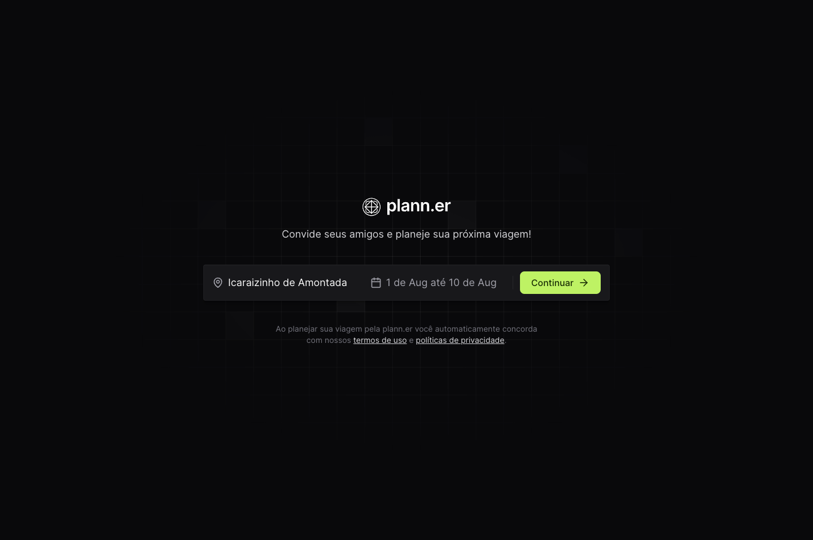
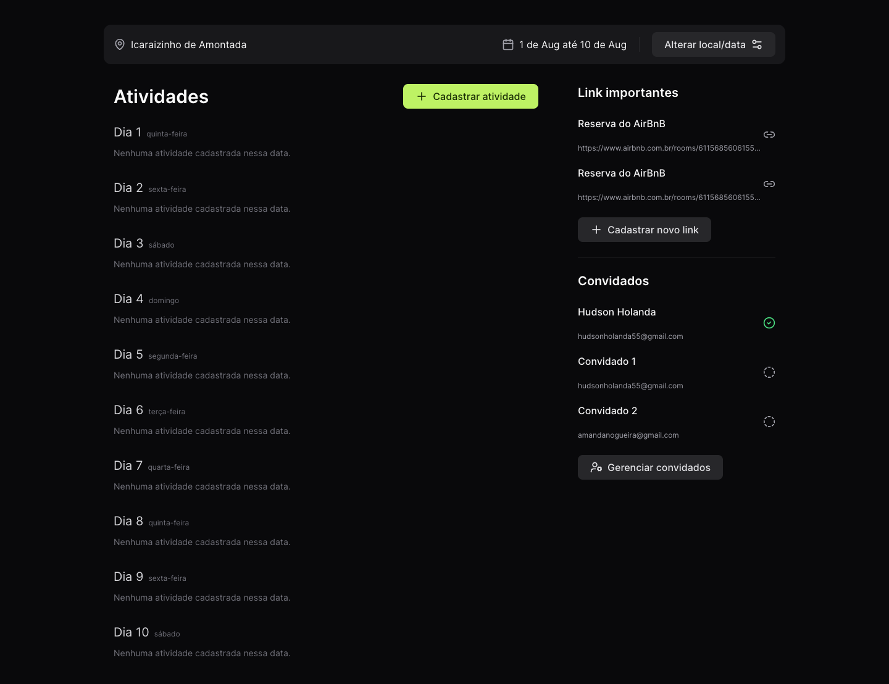

<p align="center">
  
</p>

<br />

<p align="center">
  
  
</p>

[](https://github.com/lzhudson)
[](#)
[](https://github.com/lzhudson/plann.er/stargazers)
[](https://github.com/lzhudson/plann.er/network/members)
[](https://github.com/lzhudson/plann.er/graphs/contributors)

# :pushpin: Table of Contents

* [Overview](#memorando)
* [Features](#rocket-features)
* [Installation](#construction_worker-installation)
* [Found a bug? Missing a specific feature?](#bug-issues)
* [Contributing](#tada-contributing)
* [License](#closed_book-license)

# :memorando: Overview

Plann.er is a travel planning web app.

Initially, the idea is to enter a destination, the start and end date of the trip and invite your friends. You can register all the activities you're going to do on the trip by entering your name and the date and time so that no one is left out. You can also enter important links such as the link to a particular restaurant, the location of a tourist attraction and finally you can manage your guest list.

# :rocket: Features

* Create trip
* Register start and end date from trip
* Invite people via e-mail.
* Record the activities of each day of the trip with their title and date/time.
* Register important travel links

# :construction_worker: Installation

## Configure back-end

**You need to install [Node.js](https://nodejs.org/en/download/) and then, to clone the project via HTTPS, run this command:**

```
git clone https://github.com/rocketseat-education/nlw-journey-nodejs
```

SSH URLs provide access to a Git repository via SSH, a secure protocol. If you have a SSH key registered in your Github account, clone the project using this command:

```
git clone git@github.com:rocketseat-education/nlw-journey-nodejs.git
```


**Install dependencies**

```
npm i
```

**Create the .env file with the following content**
```env
DATABASE_URL="file:./dev.db"
API_BASE_URL="http://localhost:3333"
WEB_BASE_URL="http://localhost:3000"
PORT="3333"
```

**Start development server**
```bash
npm run dev
```

## Configure front-end

**You need to install [Node.js](https://nodejs.org/en/download/) and then, to clone the project via HTTPS, run this command:**

```
git clone https://github.com/lzhudson/plann.er.git
```

SSH URLs provide access to a Git repository via SSH, a secure protocol. If you have a SSH key registered in your Github account, clone the project using this command:

```
git clone git@github.com:lzhudson/plann.er.git
```

**Install dependencies**

```
npm i
```

**Start development server**

```
npm run dev
```

# :bug: Issues

Feel free to **file a new issue** with a respective title and description on the [plann.er](https://github.com/lzhudson/plann.er/issues) repository. If you already found a solution to your problem, **I would love to review your pull request**! Have a look at our [contribution guidelines](https://github.com/lzhudson/plann.er/blob/main/CONTRIBUTING.md) to find out about the coding standards.

# :tada: Contributing

Check out the [contributing](https://github.com/lzhudson/plann.er/blob/main/CONTRIBUTING.md) page to see the best places to file issues, start discussions and begin contributing.

# :closed_book: License

Released in 2024
This project is under the [MIT license](https://github.com/lzhudson/plann.er/blob/main/LICENSE).

Designed by [Rockeseat](https://github.com/Rocketseat) and developed by [Hudson Holanda](https://github.com/lzhudson) 🖤🚀